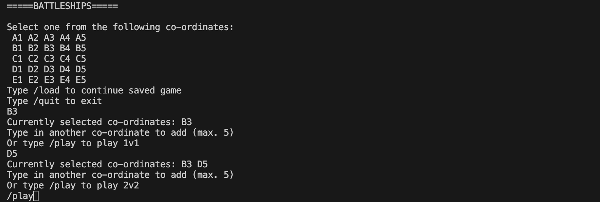
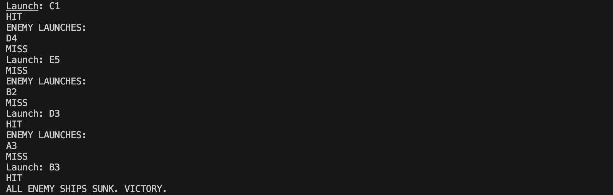
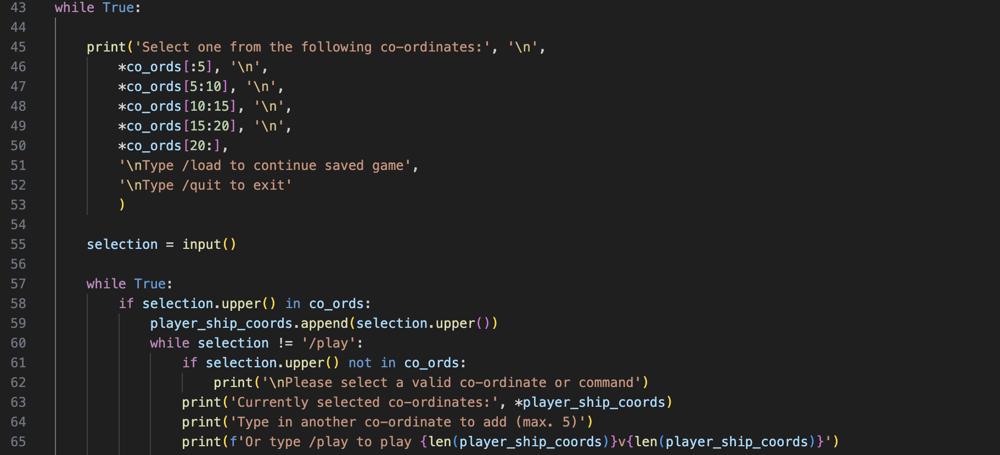
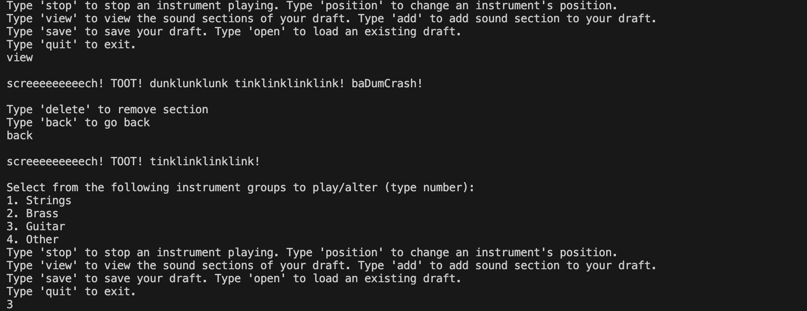
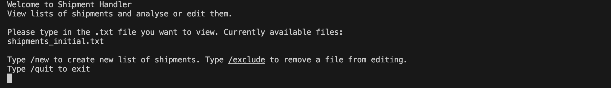
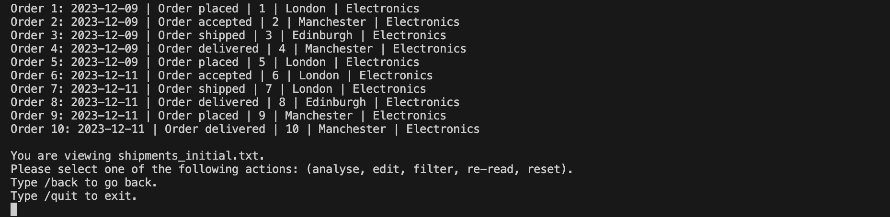
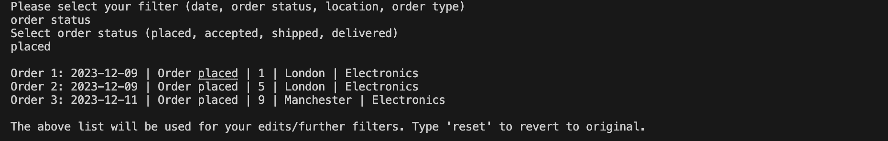

# Portfolio

Portfolio of Python projects made during my time at CoGrammar.

## Contents

1. Installation
2. Usage
3. Credits

## Installation

Copy the link of this repo then type **git clone _repo link_** into your terminal. The folder will then be downloaded to your current working directory.

## Usage

I highly recommend that you use Visual Studio Code to run the projects beacuse that is what I used while making them. (You never know what unwanted trickery might happen in the compatability with the projects by a different IDE.)

Here are some explanations of usage for each of the following projects *(in chronological order)*.

### CareerCrafter

A basic program which asks you to type in your name, surname, age, email adress and phone number and then summarises them. It is meant to be a work which shows defensive error-handling skills.

### SimpleScribe

A text manipulator which edits text inputted by the user in various styles such as bold, underline and colour and saves it to a document.

The document will store every input of text that you have entered during your run of the program, each text separated by a space. You can undo the previous text or clear the entire document. You can store them in paragraphs by entering nothing in the 'Enter your text' prompt which adds newlines. You can make your text plain by entering nothing in the 'Enter your action' prompt.

### Scrabble Calculator

This program asks the user to type in input and calculates the points total in English Scrabble.

You can add bonus scores (i.e. double letter, double word, etc.) by typing in the corresponding command before typing in your word that you wish to be calculated through your chosen bonus.

### Vehicle Dashboard

A software which stages a journey around the South West of England, displaying a vehicle dashboard at the same time. While at certain locations you can explore their attractions by paying money. While at the Fleet Services you can get refill your money or get petrol. Also while stationary you can check how much fuel, money and strikes you currently have.

While you are driving, however, this is where you may come undone. You will be driving to a selected location through three different roads, each one having its own speed range. If you drive at a speed that is out of the range you will be fined £50. If you do not have this amount it ends your program. Driving out of the speed region also gives you a strike. If you reach 3 strikes it also ends your program. Another way for the program to end is if you run out of fuel so it is essential that you go to the Fleet Services sparingly and refill your petrol. Using the indicators will enable you to switch road by decelerating/accelerating into it, but it is important that you do not change speed that ends up being out of the road's speed range.

Progress is saved through a textfile generated by the program and **your terminal should be in the same directory as this code** once this happens. The progress restarts to a fresh one once your program ends by running out of fuel or being penalised. I am planning to extend more on the progress in an upcoming update of this program. 

### Battleships

Just like a normal Battleships game. Here you can play Battleships against a CPU, selecting up to 5 co-ordinates before playing the game.

For those unfamiliar with Battleships it is a turn-based game where the objective is to sink every one of your opponent's ships by calling in a co-ordinate. If the co-ordinate is where one of your opponent's ships is it gets sunk (HIT) and if not then you missed the targets (MISS).

During the game there are also commands such as '/status' which checks your remaining ships' coordinates, '/gridscan' which displays the coordinates that you have not yet used and '/check' which shows the number of yours and your opponent's ships.

You can also save a game with the '/save' command and you will be able to load it in the first input of the co-ordinate selection menu. **Remember to have your terminal in the same directory as this program** as textfiles will be used for saved files.

A program which was shown during a CoGrammar portfolio session and liked by its staff, it is a recommended portfolio project.

### Musical Instruments

A portfolio project which specialises in my heritage and origination as a music-based student and will also have updates and new content in the coming months.

This program is a software which displays texts of the sounds of various musical instruments that are built using Object-Oriented Programming (OOP). With the program you can stage many possible combinations of text sounds and save them into a document, drafting rough ideas for a real-life music composition/piece.

Composition has taken its journey from its roots to now endless possibilities. The basic assumption of it would be the simple melodies like from Beethoven, but today music compostitions are about sound taking its freedom and going wherever it wants. The software instigates and sketches the randomness and improvisation of strings, brass, a piano and more (an electric guitar too), which plans out a composition of a modern compositional genre.  

You can change the order of the playing instruments on the display as well as saving a draft of sound sections as a name of your choice and loading an existing draft. Whichever instruments are currently playing you can open a Musical Instruments textfile and save the current sound texts onto that textfile, giving you flexibility on creating drafts. 

### Shipment Handler

The 7th project of the portfolio which handles with shipment orders, with the ability to analyse or edit orders of a selected list and to create new lists of orders also available for handling.

Like operating on a system of an online shopping platform, the user can select a shipment order and change its status on whether the shipment has been delivered and can also reiterate the order, updating either its location to which it is being sent or its product type.

The above image showcases a welcome message to the software followed by a menu prompting the user to type in one of the available shipment files it has listed. Doing this will direct the user into the file and enable them to view/manipulate shipment orders from the list.

The opening menu also provides certain commands such as /new and /exclude. The /new command is what is used for the user to create new files of shipment orders. Once this command is typed the program will ask the user to type in the number of shipment orders in the file, the location to which the orders will be delivered, the product type of the orders and finally the file name. The file with those details will then be generated, setting the date for every order to today's date with status marked as placed. The /exclude command enables the user to delete a shipment file so that it will no longer be available for the user to go into, but it will not be removed from the directory that it is in.

The second image above sees the user in a menu of dealing with shipment orders of a selected file. Here the user is given multiple options on what to do in this part of the program. One is the analyse option which lets the user read shipment orders from the file on the terminal in a well-presented way, being either a group of shipments (every shipment or a selected range) or just a single shipment to view. The edit option enables the user to either change the status of a shipment order, stepping up its delivery journey, or update the order, reassigning it with a different location or order type.

There is also a filter option which allows the user to shorten the list of shipment orders and handle with only the orders with the specific part that the user wants. The user is given four different filters: date, order status, location and order type. Using them will grant the user only the shipment orders with the information that the user has chosen, such as looking for only the orders that are place (shown in below image, filtering the list of *shipments_initial.txt*) and searching for orders delivered to a chosen location. Analyses, edits and further filters will then be used on this filtered list and the user will have to use the reset option to go back to handling the original list. 

The program stages a fluent way of managing shipment orders and files in various methods and uses the techniques of creating user-defined functions and interpreting with input and output from textfiles, making the user an operator of an unautomated ordering system (e.g. Amazon, Deliveroo, etc.)

## Credits

* JamieCook1517