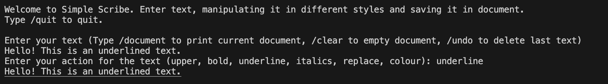
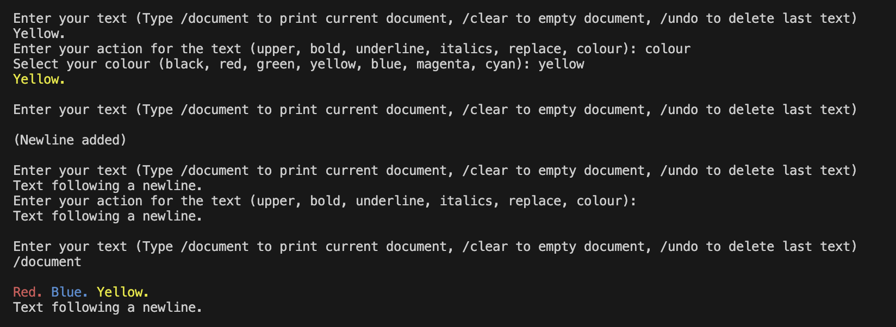
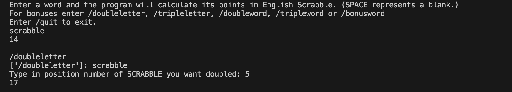
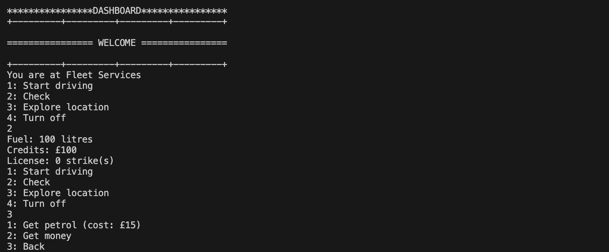
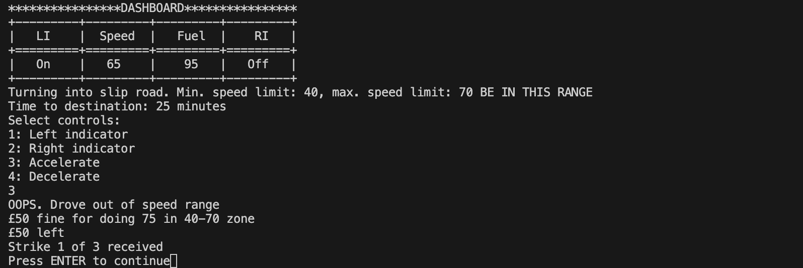

# Portfolio

Portfolio of Python projects made during my time at CoGrammar.

## Contents

1. Installation
2. Usage
3. Credits

## Installation

Copy the link of this repo then type **git clone _repo link_** into your terminal. The folder will then be downloaded to your current working directory.

## Usage

I highly recommend that you use Visual Studio Code to run the projects beacuse that is what I used in making them. (You never know what unwanted trickery might happen in the compatability with the projects by a different IDE.)

Here are some explanations of usage for each of the following projects *(in chronological order)*.

### CareerCrafter

A basic program which asks you to type in your name, surname, age, email adress and phone number and then summarises them. It is meant to be a work which shows defensive error-handling skills.

### SimpleScribe

A text manipulator which edits text inputted by the user in various styles such as bold, underline and colour and saves it to a document.

The document will store every input of text that you have entered during your run of the program, each text separated by a space. You can undo the previous text or clear the entire document. You can store them in paragraphs by entering nothing in the 'Enter your text' prompt which adds newlines. You can make your text plain by entering nothing in the 'Enter your action' prompt.

### Scrabble Calculator

This program asks the user to type in input and calculates the points total in English Scrabble.

You can add bonus scores (i.e. double letter, double word, etc.) by typing in the corresponding command before typing in your word that you wish to be calculated through your chosen bonus.

### Vehicle Dashboard

A software which stages a journey around the South West of England, displaying a vehicle dashboard at the same time. While at certain locations you can explore their attractions by paying money. While at the Fleet Services you can get refill your money or get petrol. Also while stationary you can check how much fuel, money and strikes you currently have.

While you are driving, however, this is where you may come undone. You will be driving to a selected location through three different roads, each one having its own speed range. If you drive at a speed that is out of the range you will be fined £50. If you do not have this amount it ends your program. Driving out of the speed region also gives you a strike. If you reach 3 strikes it also ends your program. Another way for the program to end is if you run out of fuel so it is essential that you go to the Fleet Services sparingly and refill your petrol. Using the indicators will enable you to switch road once you have decelerated/accelerated, but it is important that you do not change speed that ends up being out of the road's speed range.

Progress is saved through a textfile generated by the program and **your terminal should be in the same directory as this code** once this happens. The progress restarts to a fresh one once your program ends by running out of fuel or being penalised. I am planning to extend more on the progress in an upcoming update of this program. 

## Credits

* JamieCook1517