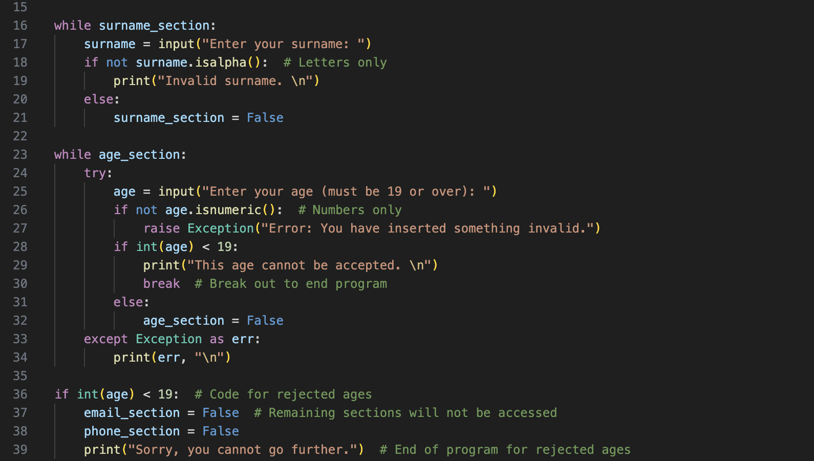
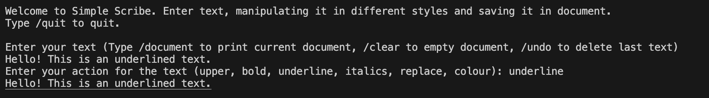
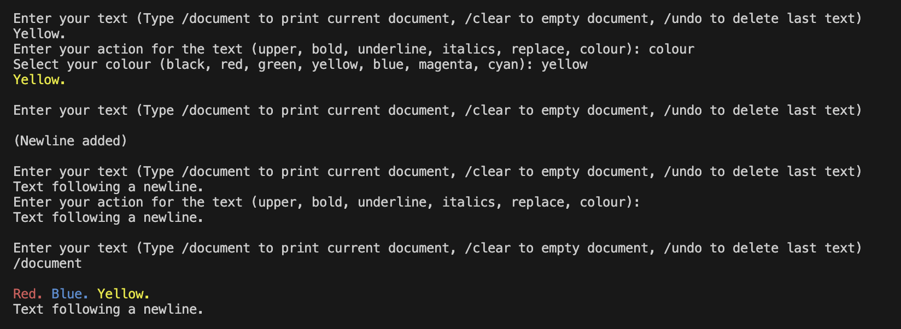

# Portfolio

Portfolio of Python projects made during my time at CoGrammar.

## Contents

1. Installation
2. Usage
3. Credits

## Installation

Copy the link of this repo then type **git clone _repo link_** into your terminal. The folder will then be downloaded to your current working directory.

## Usage

I highly recommend that you use Visual Studio Code to run the projects beacuse that is what I used in making them. (You never know what unwanted trickery might happen in the compatability with the projects by a different IDE.)

Here are some explanations of usage for each of the following projects *(in chronological order)*.

### CareerCrafter

A basic program which asks you to type in your name, surname, age, email adress and phone number and then summarises them. Nothing much else to say about it. It is meant to be a work which shows defensive error-handling skills.

### SimpleScribe

A text manipulator which edits text inputted by the user in various styles such as bold, underline and colour and saves it to a document.

The document will store every input of text that you have entered during your run of the program, each text separated by a space. You can undo the previous text or clear the entire document. You can store them in paragraphs by entering nothing in the 'Enter your text' prompt which adds newlines. You can make your text plain by entering nothing in the 'Enter your action' prompt.

### Scrabble Calculator

This program asks the user to type in input and calculates the points total in English Scrabble.

You can add bonus scores (i.e. double letter, double word, etc.) by typing in the corresponding command before typing in your word that you wish to be calculated through your chosen bonus.

### Vehicle Dashboard

## Credits

* JamieCook1517